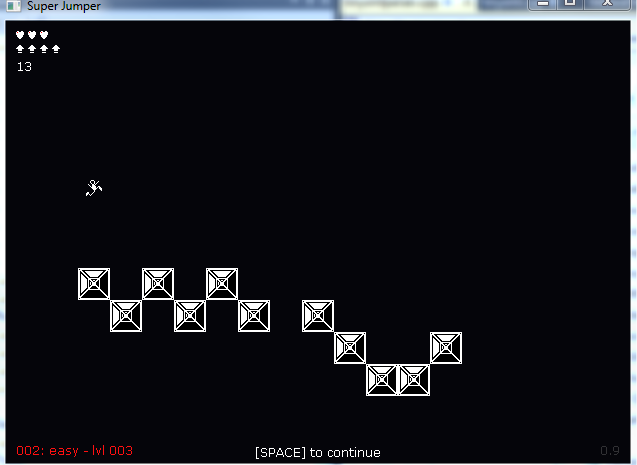

# superjumper
Small c++ minimalist multiplayer game where you have to jump on blocks to clear the level. Allows +4 players simultaneously and modding new levels/sound/sprites.

You have to clear each level presented by jumping over all blocks making them
disappear in a fourth dimension. Depending on level, you have a limited or unlimited number of boosters, something
like double jump.

Binaries and source code provided.

# How to play
<pre>
LEFT / RIGHT	: Moving the character
UP				          : Apply a boost force when character is in the air.
DOWN			      : Apply a boost force down
SPACE			      : Pause the game
ESCAPE		      : Exit the game
F1				          : Toggle windowed/fullscreen modes
</pre>

# Versions
## version 0.1 (March 1st 2011)
- Configuration values by txt
- Configurable levels, by txt, in folder levels/
- Fade out effect when block is jumped over
- First test levels
- Full screen support
- Character jumps and boosts
- Block counter and "next level" done
- First 5 levels ready

## version 0.2 (March 2nd)
- Lives and configuration
- Lives and boosts by sprites, not numbers
- Boost force down
- Collision with screen bounds

## version 0.3 (March 3rd  2011)
- N players (up to MAX_PLAYERS), configurable
- Player colors. SP always different.
- Code refactoring
- Version label

## Version 0.4 (March 3rd  2011)
- Skinning of levels, config.txt and sprites
- Refactoring to support skinning

## Version 0.5 (March 3rd  2011)
- Automatic screen center for 19x14 tiles
- States machine for splash/menu and game
- Splash screen

## version 0.6 (March 8th  2011)
- Splash & menu
- Difficulty support
- Levels added by Alvaro Marín
- Author and version labels
- Improvement in load from command line
- Autodetect skin directories
- Fix with player lives
- Time Attack mode
- Changes in menu
- Refactoring

## version 0.7 (March 9th  2011)
- Bugs with multiplayer lives
- Fixed some states resetting
- Fixed player colors
- Added 1 live to dead players when level is completed
- Added blocks counting
- Time attack mode, with countdown. You die when no time.
- Testing with PlaySound() win32 function, async.
- Adjusting easy levels for time attack and difficulty.

## version 0.8 (March 10th/11th 2011)
- Play sound from memory (PlaySound win32 function)
- Sound resources, reloading
- Initialization/destroy XACT3
- Load sounds to IXACT3Wave, playing form xact.
- Jump and boost sounds. Jump has sample rate variations.
- More sounds (menu, begin/end level)
- Fixed some wav loads when data chunksize is invalid.
- Fixed linking with d3dx10, now only links with d3dx9.
- Refactoring pause system and states when paused.
- Fixed reverse sprite detection.

## version 0.9 (March 12th 2011)
- Detecting when finish all levels.

# Credits
- Programming: gyakoo
- Design: juampalf
- Levels : alvaromrx